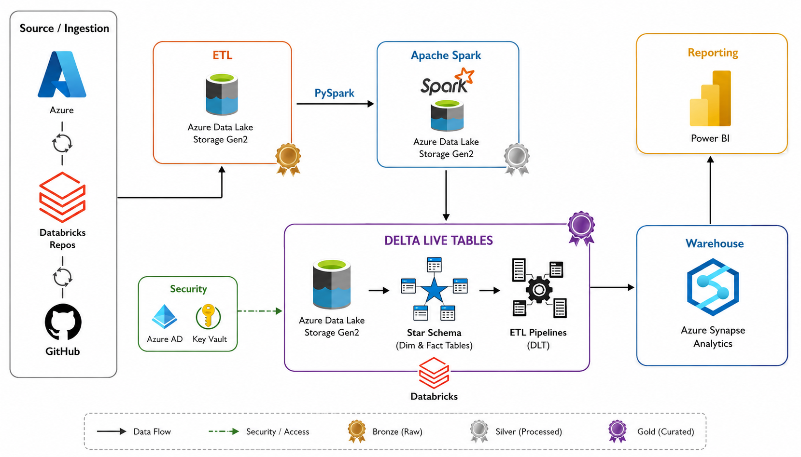
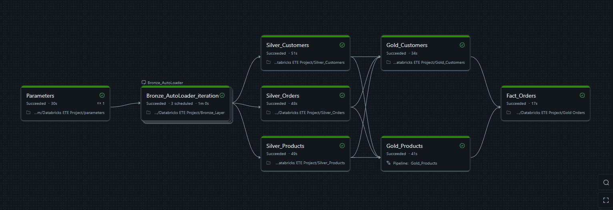

# Azure Data Engineering Pipeline using Databricks

## Overview

This project demonstrates an end-to-end Azure Data Engineering pipeline built using **Azure Databricks**, **Delta Lake**, and **PySpark**. The solution follows the **Medallion Architecture** to ingest raw data, transform it into curated datasets, and generate analytics-ready tables for downstream reporting and business insights.

The project highlights modern data engineering practices such as scalable ETL processing, incremental data ingestion, Delta Lake storage, and dimensional data modeling.

---

## Tech Stack

- **Cloud:** Microsoft Azure
- **Compute:** Azure Databricks
- **Storage:** Azure Data Lake Storage Gen2
- **Processing:** Apache Spark (PySpark)
- **Data Format:** Delta Lake
- **Languages:** Python, SQL

---

## Architecture



---

## Pipeline Overview

The pipeline follows the **Medallion Architecture**:

- **Bronze Layer** – Ingests and stores raw source data as Delta tables.
- **Silver Layer** – Cleans, validates, and transforms the data using PySpark.
- **Gold Layer** – Produces business-ready fact and dimension tables optimized for analytics and reporting.



---

## Key Features

- End-to-end Azure Data Engineering pipeline
- Medallion Architecture (Bronze → Silver → Gold)
- Incremental data ingestion
- Delta Live Tables (DLT)
- PySpark-based data transformations
- Delta Lake for ACID-compliant storage
- Star schema data modeling
- Analytics-ready datasets

---

## Project Structure

```text
.
├── Code_Files/
├── datasets/
├── architecture.png
├── pipeline.png
└── README.md
```

---

## Skills Demonstrated

- Azure Databricks
- Apache Spark (PySpark)
- Delta Live Tables (DLT)
- Delta Lake
- ETL Pipeline Development
- Data Modeling
- SQL
- Cloud Data Engineering

---

## License

This project is intended for learning and portfolio purposes.
